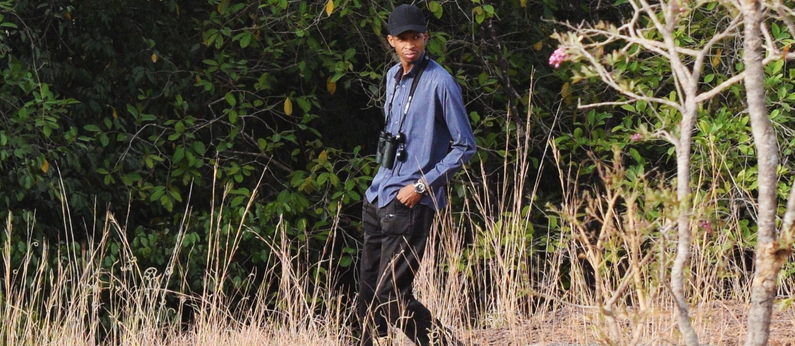

----

>Welcome to my website! My name is Bello Adamu Danmallam and I am a conservation biologist with a passion for data management and visualization. With a Master's degree in conservation biology and a Bachelor's degree in applied ecology, I have a strong background in working with large biodiversity datasets, teaching, research design, field data collection and analysis, web development, database management, and spatial analysis.
  

Throughout my career, I have built and managed databases, developed tools for efficient and effective data management and visualization, and contributed to research projects in the field of conservation biology. Currently, I am working as a Data Manager at A.P. Leventis Ornithological Research Institute (APLORI) for the African Bird Atlas Project. In this role, I oversee database management, contribute to the design and implementation of efficient data collection methods, and develop tools for data visualization and analysis.
  

In addition to my professional work, I am an avid bird watcher and enjoy learning programming languages and building websites. 
  

If you have any questions or would like to discuss a potential collaboration, please don't hesitate to contact me. Thank you for visiting my website!

__Around the Web__

<a href="mailto:adamubello001@gmail.com" class="ion-email" title="email">email</a>  <a href="https://twitter.com/BelloDanmallam1?s=08" class="ion-social-twitter" title="twitter">twitter</a>   <a href="https://github.com/bdanmallam" class="ion-social-github" title="GitHub">github</a>  <a href="https://api.whatsapp.com/send?phone=2348038175878&text=Hi%20Bello" class="fa fa-whatsapp" title="WhatsApp">whatsApp</a>
  