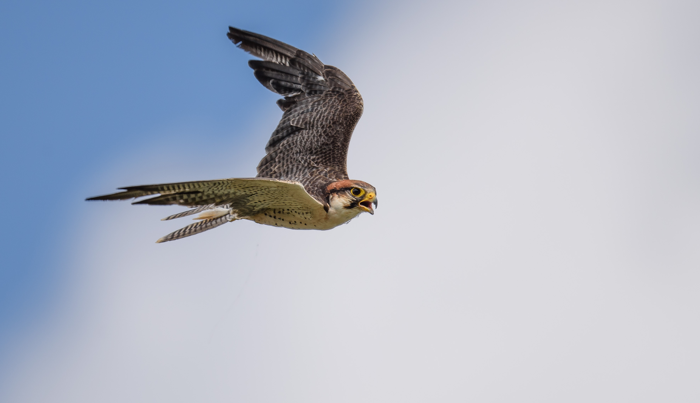

## About Me

- __Bio:__ I hold a bachelor’s degree in applied ecology from Abubakar Tafawa Balewa University, Bauchi, Nigeria. I was very lucky that after my national youth service I got a sponsorship for a master's degree in conservation biology at [A.P. Leventis Ornithological Research Institute (APLORI)](http://aplori.org), University of Jos, Nigeria, where I was trained in both conservation biology and ornithology.
- As a student at APLORI, I was fascinated by birds in-flight and how aircraft are nature-inspired, yet the conflicts that exist between birds and aircraft (bird strikes) using the same airspace. So, I decided to study how birds utilize airports landscape in Nigeria. I studied the factors that attract birds within and around the airports relating it to bird and bird strikes data, and its implication for both avian and aviation safety.
- __Interest:__ I am research-oriented and very enthusiastic about eduction.I honestly believe that no research question is too complex, and knowledge and research outcomes are meant to be communicated in a simple and engaging way to a wide audience. 
-I have a strong interest in GIS & remote sensing, data science, birds and birdstrike risk assessment. 

## Publications, Conferences, and Talks

- Evaluation of Vegetation Characteristics and Habitat Utilization by Birds in some Airports in Nigeria (Unpublished master's thesis). *A. P. Leventis Ornithological Research Institute, University of Jos, Nigeria* 

- COVID-19 Outbreak: Environmental and Socioeconomic Impacts, a Win-Lose Scenerio? (Manuscript in preparation)

- [Effects of Size and Bark Roughness of Parkia biglobosa on Lichen  Colonization: Implication for Conservation](https://doi.org/10.5455/sf.32286)

- [Presentation: A comparative Study of Tree Vegetation Composition between Fenced and Unfenced area of Sumu wildlife Park, Bauchi State. *The 6th Biennial Conference of Nigerian Tropical Biology Association (NTBA), Dutse, 2019.*](https://ntbaconf2018.wordpress.com/resources/)

- Microbes as Agents for Addressing Economic & Security Challenges. *40th Scientific Conference & Annual General Meeting of Nigerian Society for Microbiology, Bauchi, 2017*

- Presentation: Value Clarification Promotes a Healthier Future. *The 1st Regional Education Summit on HIV/AIDs in Africa (RESHAA) and Youth Speak out Conference on Reproductive Health. Federal Ministry of Education Abuja, 2011*

## Download CV

<a href="CV.pdf#" class="fas fa-download" title="Download CV as PDF">CV</a>			

